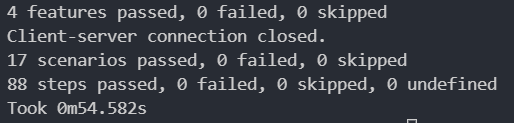

# Folder Synchroniser
This is a brief Python (3.10.0) project that aims to synchronise source and destination directories using a client-server that communications over an IP.

This was developed and tested on Windows 11, so I cannot verifiy if it will work on Linux.


## Usage
To run the program, run [main.py](src/main.py) and specify the existing source and destination folders as the --src and --dst arguments respectively, such as:

```
python .\src\main.py --src=test_components/src/ --dst=test_components/dst
```

To run the behavioural tests:
```
behave .\test\features\
```


## Methods
### Identifying modifications to the source directory
The client component recursively scans the source directory and retrieves the path of every file found. The client then iterates over the list of paths, and determines if the files are:
1) New - the path hasn't been saved by the client and thus not synchronised yet.
2) Modified - the path has been seen already, and the modification timestamp metadata of the file is more recent than the timestamp of the last scan
3) Deleted - a previously found file is not present in the list of found paths within the directory.

### Communication between the client-sever
Once the list of new, modified and deleted files has been obtained, the client shall read the data of the file, and encode it within the ISO8859-1 scheme. This scheme facilities the sending and writing of different file extensions, while being in a relatively compact format, and has yielded great results when testing against the popular document, video, and audio file types. The component then wraps this encoded data with the relative file path to the source directory folder within a JSON object, and sends the data to the server over an IP, facilitated by the [socket library](https://docs.python.org/3/library/socket.html).

If the file has been deleted, the client simply sends the path to the server. While this works well, it doesn't inform of behaviour well - given the message simply contains a path. While adding complexity, this could be improved by creating two different channels of communication between the client-server, one for writing data and one for deletion of files at a given path. As a result, it becomes incredibly clear to the server, or any future software, what it should do with the data.

## Testing
This project features behavioural tests using the [behave library](https://behave.readthedocs.io/en/stable/). The high-level scenarios and result are shown below, but additional breakdown can be found in `/test/features/*.feature`.

### Results
#### Detection and saving of new files
* Synchronise single tiered directory - Passed ✅
* Synchronise multi tiered directory - Passed ✅
* Synchronise copied file - Passed ✅
#### Detection and removal of existing files
* Synchronise directories when a file is removed - Passed ✅

#### The client rejects significantly large files
* The client is given a large file, but it is too large to send. - Passed ✅
* A rejected large file is later deleted from the client directory. - Passed ✅

#### Detection and saving of different file types
* Synchronise .mp4 files  - Passed ✅
* Synchronise .avi files  - Passed ✅
* Synchronise .mov files - Passed ✅
* Synchronise .jpg files - Passed ✅
* Synchronise .tiff files - Passed ✅
* Synchronise .png files - Passed ✅
* Synchronise .mp3 files - Passed ✅
* Synchronise .wav files - Passed ✅
* Synchronise .pdf files - Passed ✅
* Synchronise .docx files - Passed ✅
* Synchronise .xlsx files - Passed ✅

### Evidence



## Improvements
Other than the aforementioned communication, another improvement could be to reduce the amount of data required to be sent in the event of a file being modified. Currently, if a file is updated, all the file's data is resent to the server, which is inefficient. To improve this, the client could firstly identify a series of modifications, and then upload each series with a starting position within the file. Therefore, if a text file containing the string `Hello` were to be updated to `Hello World!`, the client would simply need to send `World!` along with an index informing the server to insert `World!` to the end of the string.

Furthermore, testing could be improved with stub messaging. Currently, tests in place are behavioural tests for the entire system, and so doesn't particularly well inform at a low-level what has failed. This could be improved by messaging interfaces, which could be implemented using the [socket library](https://docs.python.org/3/library/socket.html) for actual software usage, but could also be implemented by a stub messaging class that simply sends and/or receives data through a list. As a result, it would allow a further breakdown of testing - for example testing that if a new file was added, the stub messaging list would receive a single entry for the file, and could be verified standalone without the use of the server. I do something similar at work, hence the observation!